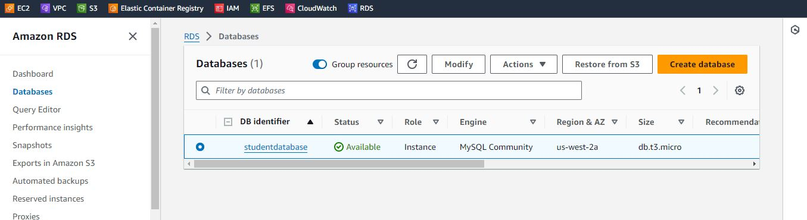
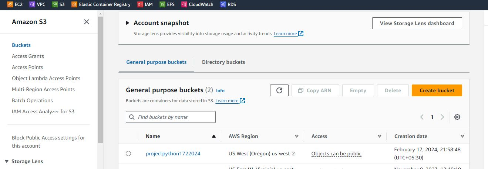
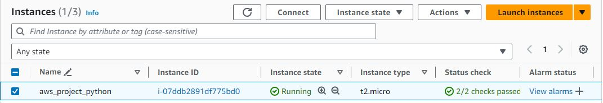
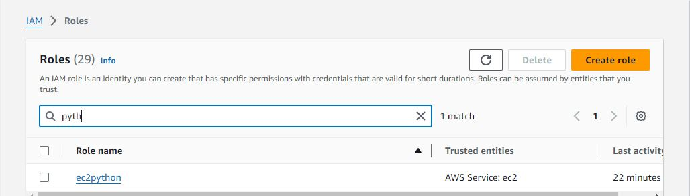
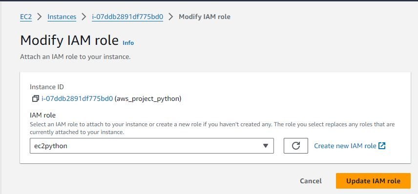
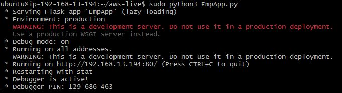
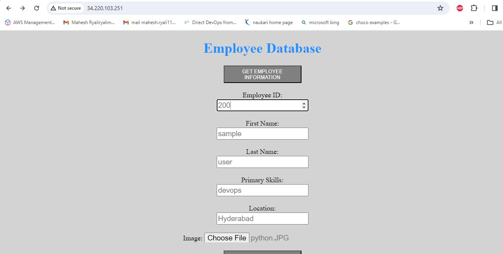
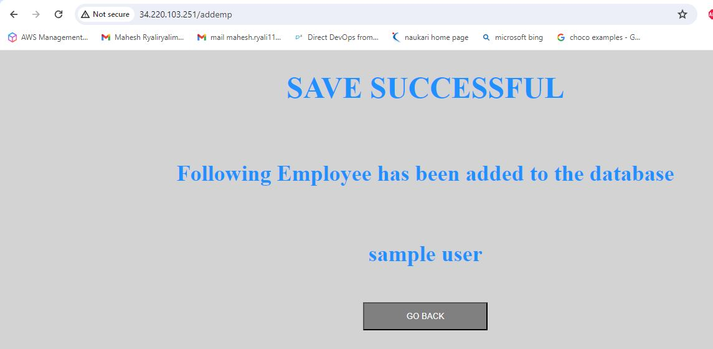
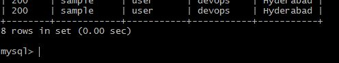

# Python application with backend mysql

## Setting up RDS and S3 buckets:
  * Creating RDS in aws cloud by giving mysql username and password.
  
  * Creating s3 bucket with specifying unique name.
  

## Setting EC2 in the same region of RDS and S3:
  * Create the ec2 machine and create a role with administration permissions attached to it.
  
  * Create an iam role and attached to ec2.
  
  

## Login to ec2 server and login to the mysql server:
  * Install mysql client in the server.
  `sudo apt install mysql-client`
  * Use following command to login to mysql server
  `sudo mysql -h <end point created in rds> -u mahesh -p`
  * Create a database by using following command
  `create database employee;`
  * Create a table in employee database. These tables are mentioned in code.
  `create table employee( emp_id varchar(20),
     first_name varchar(20),
     last_name varchar(20),
     pri_skill varchar(20),
     location varchar(20));`

## Install the following commands:
   ---
   sudo apt-get install python3,
   sudo apt-get install python3-flask,
   sudo apt-get install python3-pymysql,
   sudo apt-get install python3-boto3
   ---
## Change the configuration values of mysql database in config.py file:
   * Replace the following key to the created values
     customhost = "endpointofRDS",
     customuser = "databaseuser"
     custompass = "databasepassword"
     customdb = "employee"
     custombucket = "bucketcreatedinaws"
     customregion = "region"     

## Run the application:
  "sudo python3 EmpApp.py" and navigate the application "http://ipaddress:80"

  
   
   

  * The data stored in mysql as shown below.

  

